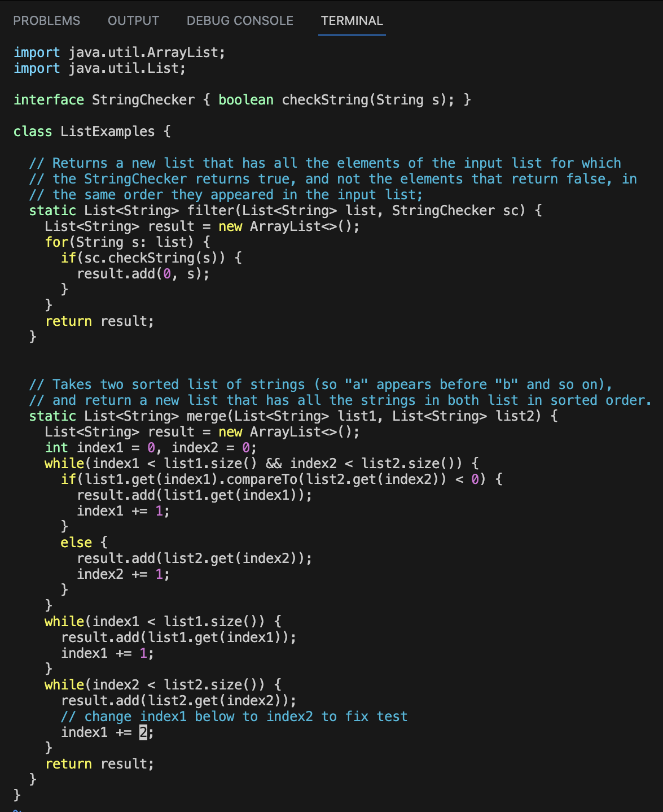

# Lab Report 4 -Vim

For each numbered step starting right after the timer (so steps 4-9), take a screenshot, and write down exactly which keys you pressed to get to that step. For special characters like <enter> or <tab>, write them in angle brackets with code formatting. Then, summarize the commands you ran and what the effect of those keypresses were.

## Step 4
**Log into ieng6**

Keys Pressed: `ssh<space>adconnor@ieng6-201.ucsd.edu<enter>`. This command logged me into `ieng6-201`, I was not asked for my password because I have already generated an `ssh` key on my computer.

## Step 5
**Clone your fork of the repository from your Github account**

Keys Pressed: `git<space>clone<space><cmd-v>`. The `<cmd-v>` command pasted the ssh link connected with my Github account. The purpose of using the ssh github link is so that I am able to clone and push my changes onto my lab7 fork.

## Step 6
**Run the tests, demonstrating that they fail**

Keys Pressed: `cd<space>l<tab><enter>`, `bash<space>t<tab><enter>`. The first command I ran put me into my `lab7/` directory and the second command ran the tests using the bash command. The use of `<tab>` im my key presses was to auto-complete the directory/file.

## Step 7
**Edit the code file to fix the failing test**

Keys Pressed: `vim<space><shift-l><tab>.<tab><enter>`, `<:$><enter><k><k><k><k><e><x><i><2><esc><:wq><enter>`. The first command takes me to the vim file of ListExamples.java, the second command allowed for me to make the necessary change to the file. `<:$><enter>` This command took me all the way to the bottom of the file, saving me a lot of down arrow key presses. Eack `<k>` press took my cursor up one line. Each `<e>` took me to the end of the first word in the line. By the time I pressed `<x>` my curor was on the number that needed to be changed and deleted it. `<i>` put me into insert mode. `<2>` addeded "2" where the 1 was just deleted. `<esc>` put me back into normal mode. `<:wq><enter>` The `wq` quit the vim editor and kept all changes that I made.

## Step 8
**Run the tests, demonstrating that they now succeed**

Keys Pressed: `<up><up><up><enter>`. I went back into my terminal history until I got back to the bash command I ran earlier, then excuted the tests again and they all passed.

## Step 9
**Commit and push the resulting change to your Github account**

Keys Pressed: `git commit -a<enter>`, `Lab Report finished!<:wq><enter>`. My first command makes sure all files modifed are commited. (In this case it was only the one ListExamples.java). Then it prompted me to add a message in a vim editor, which I did and saved. My changes were then sucessfully pushed to github.
